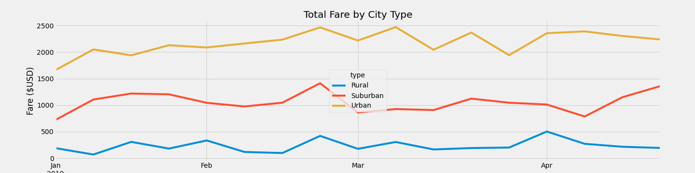

# PyBer Analysis

## Overview 
The project is to do exploratory analysis on data of ride sharing application company “PyBer”. The analysis is directed towards finding relationship between type of city, number of riders / drivers and average ride fares and create visualization of findings. It will help PyBer to improve access to ride share services and determine affordability for under-served neighborhoods

## Purpose
The purpose of this analysis is to understand relationship between types of cities and ride fares by number of rides and drivers and represent the findings in graphical manner using Python (Matpoltlib). 

## Results

The analysis for the ride-sharing data shows clearly that there is significant difference in total fare among different city types. The above graph depicts that the total fare for rural cities is way lower than urban cities, while trend of the data seems similar over the period of time.

Comparison between different data points for different types of city shows some good relationships between these data points and city types:

Total Rides are the highest in the urban cities, while lowest in the rural cities.

Total Drivers are also highest in urban cities and lowest in rural cities. 

Total fare is also following the trend of total rides and drivers and have highest amount for urban cities and lowest for rural cities. 

Average fare per ride is comparatively higher for rural and suburban cities when compared to that of urban cities. It is a disparity among the different type of cities that ride in rural and suburban are costlier than urban cities. 

Average fare per driver has the highest disparity among the different type of cities. For rural cities it is more than 3 times than urban and for suburban it is more than 2 times than urban. Hence drivers in rural and suburban are earning more although the number of rides and drivers are lesser in those cities. 

## Summary

There is a big disparity between different cities in terms of average fare by ride and driver. The rides are costlier in the rural and suburban cities and hence the earning for driver in these cities are drastically higher than that of in urban cities. 

Recommendations to minimize disparity: 
1.	It is recommended to reduce the fares for rural and suburban cities to make it more affordable as the price per ride is much higher for these cities as compared to urban cities
2.	To decrease the disparity, it is advisable to increase number of drivers in the rural and suburban cities as the number of drivers per ride are lesser and hence its increases fare per driver
3.	It is advisable to increase the fares in urban cities to bring near to sub urban level which will help to increase fare per driver and in turn helps to add more drivers for the company and offset the disparity
